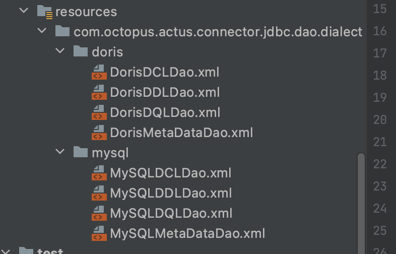

octopus是一个封装大数据组件的开源项目，目前有两个模块，operators和actus。operators是基于Flink，Spark引擎实现的一个数据处理框架，actus是基于mybatis实现的一个sql执行器，只要是支持jdbc的数据库，理论上都能通过actus来进行数据建模，目前actus支持mysql，doris。

# Operators

Operators是基于Flink，Spark引擎实现的一个数据处理框架，数据集成，数据开发，数据质量等计算任务都可以通过Operators来进行实现，其实现思路是基于Seatunnel的设计思想来实现的。

## Flink-Operator

Flink目前支持的算子有

### Source

- CSV

### Transform

- Flink SQL

### Sink

- CSV
- Console

## Spark-Operator

Spark目前支持的算子有

### Source

- CSV
- Parquet
- JDBC
- Iceberg

### Transform

- Spark SQL
- Metrics(用于数据质量)

- - count
  - distinctCount
  - nullCount
  - nullOrEmptyCount
  - min
  - max
  - mean
  - variance
  - stddev
  - median
  - distinct
  - distribution
  - uniqueRatio
  - nullRatio
  - psi

- expression(基于Google Aviator引擎实现的表达式计算方式)

### Sink

- CSV
- Console
- Parquet
- JDBC
- Iceberg

### Check

- expression(基于Google Aviator引擎实现的表达式计算方式)

### PostProcess

数据处理完成的后续动作，比如数据质量出现问题，可以选择警告，也可以选择修正。

- alarm
- correction

上述的算子基本都已经实现，基本可用。未来的规划如下：

1. 继续丰富Flink，Spark算子，新增更多的数据源
2. 统一配置，将配置翻译成Flink，Spark需要的配置
3. 目前只支持批量，未来需要做流式
4. 丰富文档，多写一些设计文档和使用文档

有兴趣的同学也可以帮忙提一些issues。

# Actus

actus是基于mybatis实现的一个sql执行器，只要是支持jdbc的数据库，理论上都能通过actus来进行数据建模。

目前actus只支持MySQL，Doris两种数据源，因为不同数据源之间存在差异性，所以通过一个统一的框架来帮助大家屏蔽数据库之间的差异，对外提供统一的API进行建模，数据服务，即席查询等操作。

目前支持的操作有：

## DDL

```java
public interface DDLDao {

    void createDatabase(String database);

    void dropDatabase(String database);

    void createTable(Table table);

    void renameTable(String database, String oldTable, String newTable);

    void modifyTableComment(String database, String table, String comment);

    void modifyColumnComment(String database, String table, String column, String comment);

    void dropTable(String database, String table);

    void addColumn(Table table);

    void removeColumn(String database, String oldTable, String column);

    void modifyColumn(String database, String table, Column column);

    void renameColumn(String database, String table, String oldColumn, String newColumn);

    void createIndex(String database, String table, Index index);

    void dropIndex(String database, String table, String index);
}
```

## DCL

```java
public interface DCLDao {

    void createRole(String role);

    void createRoles(List<String> roles);

    void dropRole(String role);

    void dropRoles(List<String> roles);

    void createUser(User userInfo);

    void dropUser(User userInfo);

    void dropUsers(List<User> users);

    void modifyPassword(User user);

    void grantUserPrivilege(Privilege privilege);

    void grantRolePrivilege(Privilege privilege);

    void grantRolesToUser(List<String> roles, String user, String host);

    void revokeUserPrivilege(Privilege privilege);

    void revokeRolePrivilege(Privilege privilege);

    void revokeRolesFromUser(List<String> roles, String user, String host);
}
```

## DQL

```java
public interface DQLDao {

    List<Map<String, Object>> queryList(@Param("sql") String sql, Map<String, Object> params);

    List<Map<String, Object>> queryListByLimit(
        @Param("sql") String sql, Map<String, Object> params, RowBounds rowBounds);

    int count(
        @Param("database") String database,
        @Param("table") String table,
        @Param("where") String where);
}
```

## DML

## MetaData

```java
public interface MetaDataDao {

    List<DatabaseMeta> getDatabaseMetas();

    DatabaseMeta getDatabaseMetaBySchema(String schemaName);

    List<TableMeta> getTableMetas();

    List<TableMeta> getTableMetasBySchema(String schemaName);

    TableMeta getTableMetaBySchemaAndTable(String schemaName, String tableName);

    List<ColumnMeta> getColumnMetas();

    List<ColumnMeta> getColumnMetasBySchema(String schemaName);

    List<ColumnMeta> getColumnMetasBySchemaAndTable(String schemaName, String tableName);

    ColumnMeta getColumnMetaBySchemaAndTableAndColumn(
        String schemaName, String tableName, String columnName);
}
```

## Dialect

目前仅支持MySQL，Doris

具体实现可参考



未来规划

1. 完成DML
2. 完成复杂的查询语句，目前只支持单表查询
3. Doris的Schema Change是异步的，需要异步去获取执行结果

如果有其他需要的同学，也欢迎提一些issues，有兴趣也可以一起参与进来，不求做大做强，只求一起学习进步